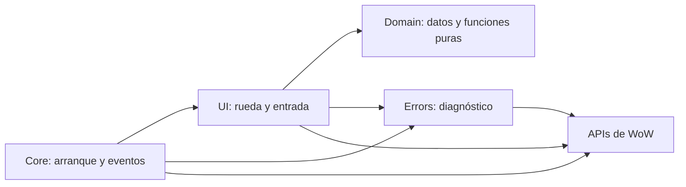

# Stack y arquitectura de Easy Marks

Usamos una separación ligera inspirada en arquitectura hexagonal: la lógica que puede ejecutarse sola no llama APIs de WoW; la interfaz conecta esa lógica con el cliente. No hay framework, contenedor de dependencias, repositorios artificiales ni clases base. Cada archivo tiene una responsabilidad concreta.

## Stack

| Parte | Tecnología | Uso |
| --- | --- | --- |
| Ejecución | Lua y APIs de WoW Retail | Marcadores, interfaz y eventos |
| Manifiesto | TOC | Metadatos, orden de carga y SavedVariables |
| Atajo | Bindings.xml | Entrada configurable, cargada por WoW por separado |
| Gráficos | Recursos nativos | Iconos de marcadores y cursor |
| Desarrollo | Python 3.10+, unittest y Lupa 2.8 / Lua 5.1 | Pruebas sin iniciar WoW |
| Paquete | Python estándar | ZIP con lista explícita de archivos |
| Especificación | OpenSpec 1.9.0 y Markdown | Intención, escenarios y tareas |

Python, Node, OpenSpec y Lupa no se distribuyen ni se necesitan dentro del juego. El cliente tiene su propio entorno Lua, con restricciones que Lupa no reproduce. No hay backend ni servicios propios.

La fuente vive en GitHub privado. `.github/workflows/ci.yml` ejecuta las pruebas y el empaquetador; `curseforge.yml` prepara releases y puede subirlas cuando el proyecto de autor esté conectado. `tools/package.py` sigue siendo el único constructor del ZIP: lista seis archivos, valida XML/TOC y contrasta sus bytes. `tools/release.py` obtiene versión/canal/changelog, prepara metadatos y sube ese ZIP mediante la API de autores; no reconstruye al publicar. El logo de `branding/` queda fuera del paquete.

CI tiene permiso `contents: read`; el token de CurseForge solo llega al paso de subida, sin archivos `.env` ni logs de credenciales. La subida requiere un tag que coincida con el TOC y un commit incluido en `main`. El adaptador usa los endpoints WoW del [packager mantenido](https://github.com/BigWigsMods/packager/blob/master/release.sh), resuelve exactamente la versión Retail y no elige otra si falta. No sigue redirects autenticados ni reintenta POST automáticamente. Guarda un recibo con ID de archivo y SHA-256; la API real y la moderación quedan pendientes hasta conectar el proyecto.

## Responsabilidades y dependencias

| Archivo | Responsabilidad | Dependencias |
| --- | --- | --- |
| `Domain/Markers.lua` | Ocho colores, mapeo de índices de mundo/unidad, validación y macros de marcado/limpieza | Lua estándar; comandos, texto localizado y nombres de delegados llegan como argumentos |
| `UI/Wheel.lua` | Rueda, arrastre, minimapa, cursor, botones seguros y Escape | Dominio, diagnóstico y APIs de WoW |
| `Core.lua` | Registro de comandos, arranque y eventos atribuidos al addon | Interfaz, diagnóstico y ciclo de vida de WoW |
| `Errors.lua` | Captura, límite, persistencia y visor de errores propios | Reloj/metadatos, SavedVariables e interfaz del cliente |

El TOC carga `Errors.lua`, dominio, interfaz y finalmente `Core.lua`. Los módulos comparten únicamente el namespace privado que WoW entrega al cargar el addon. `Wheel.Create()` construye los marcos y devuelve la función para abrir/cerrar fuera de combate. El arranque conserva esa función para los comandos opcionales. Los clics reales usan los handlers seguros de los botones.

No añadimos una máquina de estados paralela a los marcos protegidos. La visibilidad y los atributos seguros mantienen el estado real; duplicarlo en un modelo Lua podría desincronizarse durante combate. Las pruebas unitarias cubren funciones puras y el registro; las transiciones protegidas pertenecen a las pruebas de integración y al cliente.

## Interacción y salida

La rueda tiene visibilidad independiente de la selección. Elegir un color con clic izquierdo prepara una única acción y muestra el símbolo junto al cursor. Confirmar o cancelar consume la selección y deja la rueda abierta. El icono EM alterna su visibilidad y cancela la selección; no hay título ni cierre en la rueda. Escape solo cancela una selección; sin selección queda libre para el cliente y no cierra la rueda. Se conservan el atajo y los comandos opcionales.

La capa de entrada usa estrato `HIGH`; rueda y minimapa usan `DIALOG`, para seguir accesibles al seleccionar. El cursor visual no captura el ratón. No hay ventana explicativa. La rueda es el único propietario del binding temporal de Escape: se asigna al armar la selección y se elimina al cancelarla, confirmarla o cerrar la rueda.

El fondo es un disco con opacidad 0.32, usando una textura de color y la máscara circular nativa `Interface/CharacterFrame/TempPortraitAlphaMask`. El contenedor y disco miden 200 × 200, con los marcadores a radio 68 del centro. Se compactan los márgenes sin usar `SetScale`: permanecen los iconos de 29 × 29, las bases circulares de 40, los botones de 42 × 42 y las × de limpieza de 18 × 18. Clear all ocupa 58 × 24 en el centro, ligeramente elevado; el agarre queda debajo. El fondo vacío no captura el ratón.

La zona arrastrable mide 32 × 16 y está 22 unidades por debajo del centro, separada de Clear all y sin fondo. Dos líneas de 14 × 1 indican el agarre de forma discreta. Arrastrar no limpia; su clic derecho cancela una selección pendiente. Todos los textos propios del producto están en inglés, sin dependencias de traducción; la documentación técnica continúa en español. No se traducen datos históricos del logger ni mensajes originales del cliente.

El minimapa usa un botón circular de 31 × 31: borde dorado nativo, disco interior oscuro de 27 × 27 y texto EM con `GameFontNormal`, todos anclados al mismo centro. Sustituye la estrella y el borde de tracking asimétrico. Se dibuja en Lua con recursos nativos; no necesita un bitmap, biblioteca o archivo adicional en el paquete. Conserva nombre, binding y clic derecho para diagnóstico.

El arrastre parte del agarre central y actualiza coordenadas mediante `OnUpdate` solo fuera de combate. No usa `StartMoving`/`StopMovingOrSizing`, cuya detención puede estar restringida si empieza combate. Soltar, ocultar o `PLAYER_REGEN_DISABLED` borran el estado local sin mover marcos protegidos. Iniciar arrastre cancela una selección pendiente. La posición se guarda durante el movimiento permitido en `EasyMarksDB.position`, como desplazamiento respecto al centro, y se restaura al cargar. Los valores inválidos vuelven al centro.

El clic final ejecuta marcador `[@cursor]` y ping `[@cursor] 5`. Son dos operaciones independientes: permisos y resultados pueden diferir. El post-handler oculta la capa después de procesar el clic y borra la macro preparada. `SecureHandlerWrapScript` solo ejecuta ese post-handler cuando el pre-handler devuelve un segundo valor no nil; se usa `return nil, true`. El primer valor conserva el botón original.

Las referencias entre marcos se configuran con `SecureHandlerSetFrameRef`, sin depender de métodos añadidos por `OnLoad` de plantillas combinadas. `Bindings.xml` se distribuye, pero no se enumera en el TOC, porque WoW usa un cargador específico para atajos.

Cada icono tiene una × creada al iniciar con `SecureActionButtonTemplate`. Izquierdo y derecho ejecutan la misma macro: `/cwm ID` limpia ese color del suelo y `/click [@target,exists] EasyMarksClearTarget LeftButton` invoca un botón nativo `raidtarget` con acción `clear` y unidad `target`. El objetivo se limpia aunque use otro símbolo; si no existe, solo se intenta la limpieza de suelo. Los demás colores y unidades permanecen.

Clear all usa `/cwm` seguido del valor localizado de la global `ALL` y `/click EasyMarksClearAllUnits LeftButton`. El segundo botón usa `raidtarget`/`clear-all`, que invoca `RemoveRaidTargets()` dentro de la acción nativa. Así retira todos los iconos de unidades del grupo sin exigir objetivo ni iterar unidades desde Lua propio. No usar `/cwm 0` como equivalente a todos ni el literal inglés `all` en clientes traducidos.

Los dos delegados están precreados y sin captura física de ratón; son acciones nativas, nunca macros encadenadas ni `/run`. Todos los controles ejecutan al soltar, con `useOnKeyDown = false` y atributos comodín para modificadores. Un pre-handler seguro cancela cualquier selección antes de limpiar y deja la rueda abierta, sin ping. Las dos operaciones tienen permisos independientes: no se reintenta ni se anuncia éxito. La ruta `/click` se apoya en el [handler del cliente](https://github.com/Gethe/wow-ui-source/blob/live/Interface/AddOns/Blizzard_ChatFrameBase/Shared/SlashCommands.lua#L681-L697) y las [acciones nativas](https://github.com/Gethe/wow-ui-source/blob/live/Interface/AddOns/Blizzard_FrameXML/SecureTemplates.lua#L545-L583); su aceptación efectiva sigue pendiente de probar en Midnight.

Los símbolos también usan `SecureActionButtonTemplate`: un wrapper previo arma el terreno solo en el clic izquierdo; el derecho cancela la selección y ejecuta la macro del objetivo. `BuildTargetMacro` transforma el índice de mundo al de icono de unidad: por ejemplo, azul es mundo 1 pero unidad 6. La macro combina `/tm [@target,exists] !N` con `/ping [@target,exists] 5`; `!` conserva la marca al repetir y las condiciones evitan señales sin objetivo. Las decisiones permanecen en los comandos nativos, sin consultar valores secretos desde Lua propio. Los nombres de comandos se obtienen del cliente al iniciar.

El parser de ping retorna antes del fallback si no satisface la condición; con `target` explícito el manager envía un ping de unidad. Referencias: [parser de ping](https://github.com/Gethe/wow-ui-source/blob/live/Interface/AddOns/Blizzard_ChatFrameBase/Mainline/SlashCommandsOverrides.lua), [marcador de objetivo](https://github.com/Gethe/wow-ui-source/blob/live/Interface/AddOns/Blizzard_ChatFrameBase/Shared/SlashCommands.lua) y [destino del ping](https://github.com/Gethe/wow-ui-source/blob/live/Interface/AddOns/Blizzard_PingUI/Blizzard_PingManager.lua). La simulación de pruebas cubre únicamente estas formas de macro, no el parser completo ni la aceptación del servidor.

El hover conserva el tooltip original mediante `SecureHandlerWrapScript` sobre `OnEnter`. Solo el movimiento real revela el botón. `RegisterAutoHide(0.15)` y `AddToAutoHide` agrupan la × con su icono, con tolerancia al salir; el mecanismo nativo únicamente oculta el control, nunca retira marcadores. La rueda desregistra y oculta los ocho controles al cerrarse. Las pruebas simulan pertenencia al grupo, sin demostrar geometría, tiempos nativos ni seguridad en combate. Contratos: [worldmarker](https://github.com/Gethe/wow-ui-source/blob/live/Interface/AddOns/Blizzard_FrameXML/SecureTemplates.lua), [wrappers de hover](https://github.com/Gethe/wow-ui-source/blob/live/Interface/AddOns/Blizzard_RestrictedAddOnEnvironment/SecureHandlers.lua) y [handles restringidos](https://github.com/Gethe/wow-ui-source/blob/live/Interface/AddOns/Blizzard_RestrictedAddOnEnvironment/RestrictedFrames.lua).

## Diagnóstico y pruebas

El logger captura inicio y callbacks instrumentados mediante `xpcall`, más bloqueos atribuidos al addon. Conserva 30 entradas, agrupa repeticiones consecutivas y no reemplaza el manejador global. Los datos se escriben en disco al recargar o cerrar sesión. Rutas y límites en [DIAGNOSTICO.md](DIAGNOSTICO.md).

- `tests/unit`: dominio sin APIs de WoW; registro con dobles mínimos de reloj, metadatos y salida de errores.
- `tests/integration`: carga real de los módulos Lua con el contrato del cliente simulado en `tests/support/wow_mock.lua`. Cubre marcado único, Escape, cierres, colores, modificadores, combate simulado y errores.
- `tests/test_manifest.py` y `test_openspec_scope.py`: carga declarada y límites de especificación.
- [PRUEBAS.md](PRUEBAS.md): apariencia, entrada real, motor protegido, persistencia en disco y recepción por otro jugador.

Los comandos están en [CONTRIBUTING.md](../CONTRIBUTING.md). Un mock correcto para un contrato concreto no demuestra compatibilidad completa con WoW. Los resultados de cada entrega y las comprobaciones pendientes viven en el plan de Team Harness.

## Cómo crecer sin añadir capas innecesarias

Una regla que puede resolverse con argumentos y un resultado va al dominio. El código que crea marcos o llama al cliente va a la interfaz. Un nuevo evento de arranque va a Core. Separar otro módulo solo cuando haya una responsabilidad nueva o el archivo deje de ser legible; no crear interfaces con una sola implementación por anticipación.

Referencias del cliente reflejadas en un repositorio comunitario: [contrato de handlers seguros](https://github.com/Gethe/wow-ui-source/blob/live/Interface/AddOns/Blizzard_RestrictedAddOnEnvironment/SecureHandlers.lua), [acciones seguras](https://github.com/Gethe/wow-ui-source/blob/live/Interface/AddOns/Blizzard_FrameXML/SecureTemplates.lua), [pings](https://github.com/Gethe/wow-ui-source/blob/live/Interface/AddOns/Blizzard_PingUI/Blizzard_PingManager.lua).
